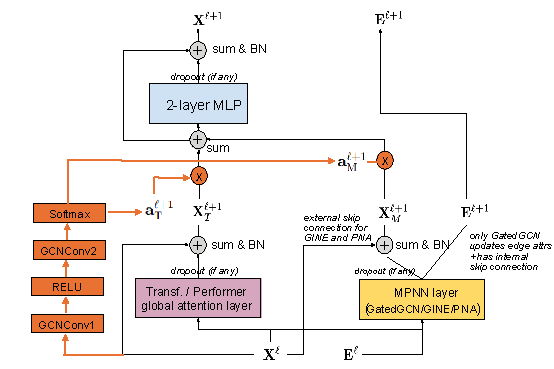

# Leveraging Weighted Sums for Integrating Message-Passing and Global Attention in GPS Graph Transformer

The General, Powerful, and Scalable (GPS) framework aims to integrate local message-passing with global attention for graph learning. However,
its fixed-layer design may not optimally adapt to different graph structures. In this work, we propose Weighted GPS (WGPS), an extension of
the GPS framework, which employs a dynamic gating mechanism to adaptively balance local message-passing and global attention layers. Each
node in the graph receives customized scaling coefficients computed via a dynamic gating network, enabling more flexible and context-aware
representation learning. Our model leverages node-level features to compute weighted sums of local and global components, allowing for greater
adaptability across datasets. Experimental results on several graph benchmarks demonstrate that while WGPS can tailor the contribution of each
layer to dataset-specific needs, achieving optimal performance remains challenging due to the inherent stochasticity in training. Nonetheless,
our analysis reveals valuable insights into graph structure, highlighting how different datasets benefit from varying emphases on local or global
information. This adaptive architecture offers a promising direction for future research in modular and scalable graph neural networks.

You can find our experiment notebook, named `official_experiment.ipynb`, and our written paper about the project 'Weighted Graph GPS - our paper.pdf' in this repository.

Based on GraphGPS: General Powerful Scalable Graph Transformers
